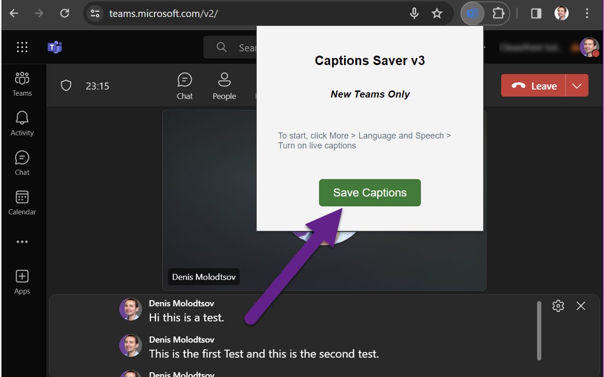

# MS Teams Live Captions Saver Extension

The MS Teams Live Captions Saver is a Chrome extension that allows you to capture and export live captions from Microsoft Teams. It is very helpful for those who want to save important discussions and keep track of the conversations for later reference.

## Install from the Chrome Store

[MS Teams Live Captions Saver. Chrome Web Store](https://chromewebstore.google.com/detail/ms-teams-live-captions-sa/admggdkgfaifbniocphilidmpjbfldjc?pli=1)

## Installing extension via the "Load unpacked"
The MS Teams Live Captions Saver Extension can also be installed via the "Load unpacked" option in Chrome/Edge/Brave browsers. Here's how:

1. Download the `teams-captions-saver.zip` file and unzip it anywhere on disk.

2. Open Chrome, Edge or Brave browser  and navigate to the Extensions page:
   - edge://extensions/ -  edge browser
   - chrome://extensions/ -  google chrome browser
   - brave://extensions/ -  brave browser


3. Enable Developer mode by clicking the toggle switch (typically, at the top right).

4. Click the "Load Unpacked" button and select the directory containing your extension files. Use the unzipped `teams-captions-saver` directory.


## Usage

To use the Chat Transcript Saver extension:

1. Navigate to a Microsoft Teams page in the browser https://teams.microsoft.com.

2. Join a meeting.

3. Turn on live captions. This is done by clicking on the ellipsis button in the meeting controls, then clicking "Turn on live captions".


3. When you're finished, click "Save Captions". The transcript will be downloaded as a YAML file.




## Sample data exported

Data is exported as a Yaml file. Here's a sample of the data exported:

```
Name: Denis Molodtsov
Text: There I'm going to test this feature. Another test, test, test, test.
Time: 21:55:59
----
Name: Denis Molodtsov
Text: Hi this is a test.
Time: 21:56:05
----
Name: Denis Molodtsov
Text: Did you get any of this?
Time: 21:56:08
----
Name: Denis Molodtsov
Text: This is a test
Time: 21:56:08
----

```
## Standalone JavaScript. When you can't use browser extensions
But what if you can't use extensions for security reasons? Well, in this case:
- Join a meeting using a browser.
- Start the live captions using the built-in MS Teams feature.
- Open the browser console.
- Paste the [Capture-Teams-Captrions - YAML.js](https://github.com/Zerg00s/Live-Captions-Saver/blob/master/Standalone-scripts/Capture-Teams-Captrions%20-%20YAML.js) into the console and run it.
- Once you are ready to dowload a transcript, open the console window again and run this command: `downloadYAML();`
- A text file with a transcript will be downloaded.

Please note that this extension works on Microsoft Teams pages only during the meetings and only when the live captions are first turned on.

## Contributing (Developers only)

### Update the manifest.json file
- Open manifest.json
- Increment the version number

### Package the extension


### Publish new version to the Chrome Web Store
- Navigate to [Chrome Developer Dashboard.](https://chrome.google.com/webstore/devconsole])
- Click the Add new item button.
- Click Choose file > your zip file > Upload. If your item's manifest and ZIP file are valid, you can edit your item on the next page.


## Disclaimer

Please note that the MS Teams Live Captions Saver Extension captures and saves live captions from meetings, which might include sensitive information and private conversations. Therefore, before using this tool, you are required to obtain consent from all parties involved in the meeting. 

You must ensure that the use of this extension complies with all applicable laws and regulations in your jurisdiction, including but not limited to privacy laws, data protection regulations, and terms of service of Microsoft Teams. In some locations, recording or transcribing a conversation without the knowledge and consent of all participants could be illegal.

This tool is provided for use "as is" and the developer assumes no responsibility for any legal issues that may arise from its use, including but not limited to privacy violations or data breaches. Users are solely responsible for the use of this tool and ensuring they comply with all local, national, and international laws.

By using this extension, you agree to use it responsibly and ethically, and acknowledge that you have understood and accepted all the potential legal implications.
