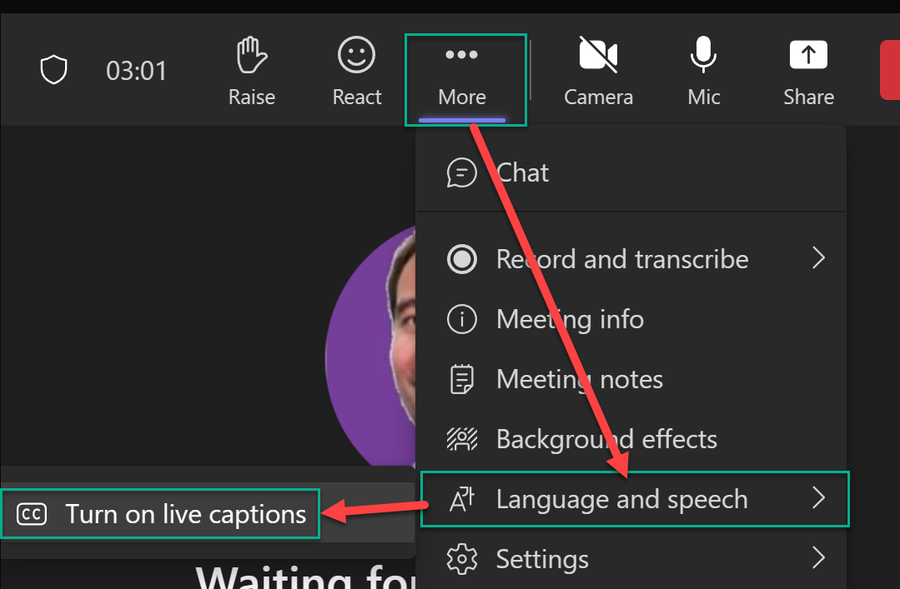
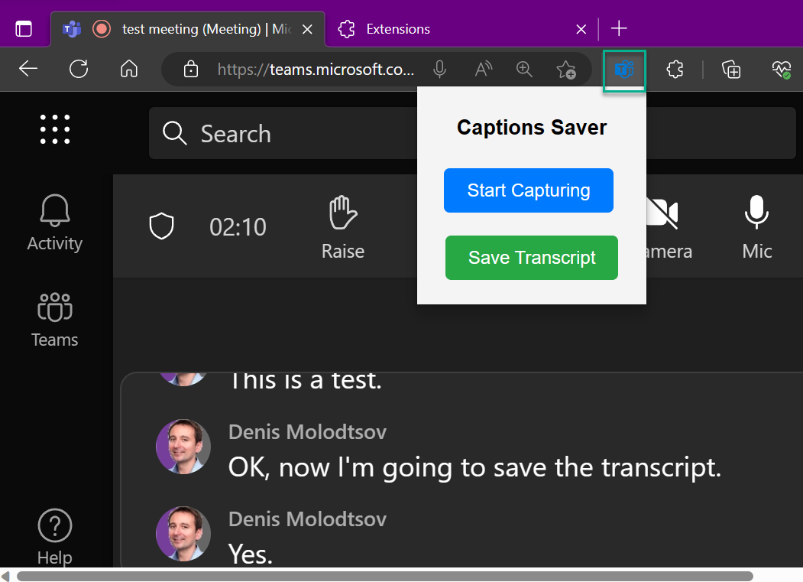

# MS Teams Live Captions Saver Extension

The MS Teams Live Captions Saver is a Chrome extension that allows you to capture and export live captions from Microsoft Teams. It is very helpful for those who want to save important discussions and keep track of the conversations for later reference.

## Installation

The MS Teams Live Captions Saver Extension is packaged into a .crx file, which can be installed directly onto Chrome. Here's how:

1. Download the `chat-transcript-extension.crx` file.

2. Open Chrome and navigate to the Extensions page (chrome://extensions).

3. At the top right, turn on Developer mode.

4. Drag and drop the downloaded `chat-transcript-extension.crx` file onto the Extensions page.

5. A pop-up will appear asking to confirm the new extension installation. Click "Add Extension".

After the extension is installed, you will see its icon appear on the right-hand side of the Chrome address bar.

## Usage

To use the Chat Transcript Saver extension:

1. Navigate to a Microsoft Teams page in the browser https://teams.microsoft.com.

2. Join a meeting.

3. Turn on live captions. This is done by clicking on the ellipsis button in the meeting controls, then clicking "Turn on live captions".



4. Click on the extension icon in the address bar, then click "Start Capturing".



3. When you're finished, click "Save Transcript". The transcript will be downloaded as a YAML file.

## Sample data exported

Data is exported as a Yaml file. Here's a sample of the data exported:

```
Name: Denis Molodtsov
Text: There I'm going to test this feature. Another test, test, test, test.
Time: 21:55:59
----
Name: Denis Molodtsov
Text: Hi this is a test.
Time: 21:56:05
----
Name: Denis Molodtsov
Text: Did you get any of this?
Time: 21:56:08
----
Name: Denis Molodtsov
Text: This is a test
Time: 21:56:08
----

```


Please note that this extension works on Microsoft Teams pages only during the meetings and only when the live captions are first turned on.
